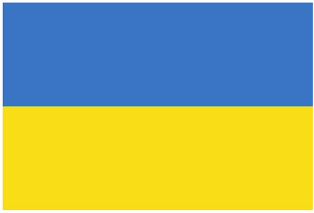

## Curriculum Vitae

# Jana Semenova

Web Developer | Frontend | Fullstack

## Contacts

- [Email](mailto:jana.semenova@web.de)
- [Telegram](https://t.me/typeweb)
- [LinkedIn](https://www.linkedin.com/in/jana~semenova/)
- Skype • yanasemenova
- Discord • wixhub#0725    
Location -> Germany | Work Permit

## Summary

With over 6 years of experience in software development, I most focused on developing web applications using Angular framework and TypeScript. When I am solving a problem I am always searching for a better way. Depending on the requirements it could be either the faster solution or the higher quality result. I constantly improve my qualifications and regularly update my professional knowledge following rapid development of web technologies.

🔗 [Portfolio](https://portefeuille.bitbucket.io/)  
🔗 [GitHub](https://github.com/wixhub)

## Some of my Skills 🛠

| Angular       | RxJS       | MongoDB    | KISS, YAGNI, DRY, SOC      |
|---------------|------------|------------|----------------------------|
| AngularJS     | NgRx       | PostgreSQL | Multitasking Abilities     |
| TypeScript    | Nx         | Firebase   | Problem-Solving            |
| JavaScript    | Webpack    | jQuery     | Attention to Detail        |
| HTML5         | Unit Tests | Node.js    | Critical Thinking          |
| CSS/SCSS      | Jasmin     | NPM, Git   | Teamwork and Collaboration |
| NGX Bootstrap | Karma      | AWS        | Active Listening           |

## Code example

```javascript
// Reverse a String

function reverseString(str) {
  return str.split("").reverse().join("");
}
```

## Experience

Internship as Frontend Developer | [Yolawo UG](https://yolawo.de/)  
_May 2021 - December 2021 • Kirchzarten, Germany_
- Developed a sport club event booking system web applications.
- Maintained a features: [Rechnungen im System einsehen & verwalten (DE)](https://yolawo.de/2021/09/24/yolawo-update-09-2021/)
- Implemented user interface and data visualization, resulting in 36% increase in product sales.  
🛠 Angular 11-13, RxJS, NgRx, TypeScript, HTML5, Sass, Jasmin, Karma, Java, Spring, MongoDB, AWS, Git 🛠

## Education

🪙 Rolling Scopes School   
_March 2022 - present_   
JavaScript/Front-end online course  

🪙 Bauman Moscow State Technical University  
_September 2008 - June 2010_  
Faculty • Computer Science And Control Systems  
Department IU3 • Information Systems and Technologies  
⛉ Master of Science  
GPA: A  

🪙 Bauman Moscow State Technical University   
_September 2002 - June 2004_  
Faculty: Computer Science And Control Systems  
Department IU5: Computer Science And Computer Engineering  
⛉ Bachelor of Science  
GPA: A  

🔗 [My Certificates (Angular App)](https://zertifikate.bitbucket.io/)  
## Spoken Languages
- English • Intermediate
- German  • Intermediate